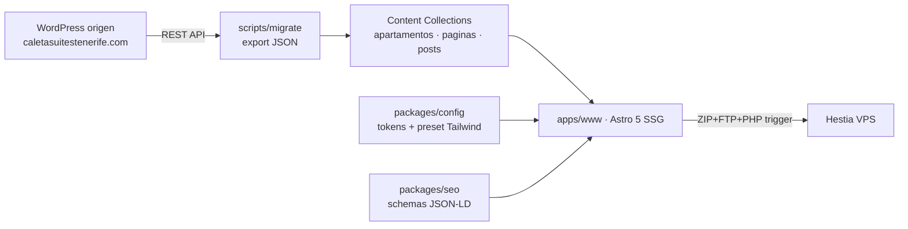

# Arquitectura — caletasuites-web

## Visión general

Monorepo pnpm que replica el patrón probado de logopedajessica-web: una única app Astro estática (`apps/www`) que sirve la web bilingüe de Caleta Suites Tenerife, con paquetes compartidos para tokens de marca y SEO. El contenido proviene de una migración del WordPress actual (REST API → JSON → MDX en Content Collections), con la restricción de URLs de producción inmutables.

## Componentes

### apps/www

App Astro 5 SSG. i18n nativo: EN en raíz, ES bajo `/es/` (réplica WPML, x-default=en). `trailingSlash: 'always'`. Layout con GTM condicional (`PUBLIC_GTM_ID`), Consent Mode v2 (default `denied`) + banner de cookies (`CookieBanner.astro`, conectado a `caletaConsentGranted()`), JSON-LD LodgingBusiness, OG/Twitter, canonical. AAA: skip links, focus visible y contraste de color ≥7:1 en todo el texto (azul de marca `#37597C`).

**Archivos clave**: `apps/www/astro.config.mjs`, `apps/www/src/layouts/Layout.astro`, `apps/www/src/components/{Header,Footer,CookieBanner}.astro`, `apps/www/src/scripts/analytics.ts`, `apps/www/src/content/config.ts`, `apps/www/src/utils/siteConfig.ts`

### packages/config

Única superficie de tokens de marca (colores, tipografías, espaciados) consumida por el preset Tailwind. Tokens provisionales hasta extraer los reales del CSS del tema WP (archub).

**Archivos clave**: `packages/config/tailwind.preset.cjs`, `packages/config/tokens/index.cjs`

### packages/seo

Esqueleto para schemas JSON-LD cross-app y helpers. Se poblará cuando una app consuma desde el shared.

### scripts/migrate

Pipeline de migración dirigido por scripts: `00-inventario` (sitemaps → inventario-urls.json), `01-export-wp` (REST API → tmp/wp-export/*.json), `02-to-mdx` (JSON → MDX), `03-download-assets` y `04-verify-urls` (pendientes de escribir/ejecutar).

## Flujo de datos

Contenido WP (páginas, posts EN/ES, media) → export JSON → transformación a MDX con frontmatter Zod (HTML de Elementor embebido sin convertir, iframes Icnea intactos) → rutas Astro con `getStaticPaths` que sirven cada URL exacta de producción → build estático → deploy FTP (ZIP + lftp + PHP trigger con manifest cleanup) a Hestia.

## Decisiones de diseño

Las decisiones de arquitectura se registran en la memoria persistente (`mem_save type=decision`). Destacadas: URLs de producción inmutables (topic `seo/urls-inmutables`); HTML Elementor embebido en MDX para preservar el maquetado exacto; tokens extraídos del CSS real en vez de paleta nueva.
